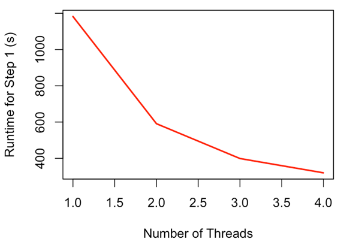

.. include:: global.rst

.. _benchmarking:

Benchmarking and Hardware Requirements
======================================

Use of an HPC or powerful workstation is not necessary, although could speed things
up. Testing was performed on a 2014 iMac with a 4-core Intel i7 processor and
32GB of memory, although only a small fraction of this memory was needed.

Runtime scaling
---------------
With a ddRAD dataset sequencing on HiSeq 2500 paired-end with 150bp reads, including
48 individuals and generating 51,931 alignments, the following command was run:

.. code-block:: bash

  mrbait -L wtd_run1.loci -T 4 -c 12 -l 150 -b 60 -K 1.0 -d 200 -F snp=1,10 -s tile=30

A total of 46,219 alignments passed filtering, of which 44,808 included a
conserved region long enough for target design. 27,102 targets passed filtering
(which was performed based on number of flanking SNPs) and were used to design
43,342 baits.  Total runtime across 4 threads was 392 seconds.

Parallel processing is implemented where practical, primarily in steps
1 and 2. For step 1 (alignment parsing), it splits alignment files into groups,
to be parsed by each daughter process. During parsing, when an entry must be added
to the SQLite database, this cannot be performed in parallel, so a database lock
is implemented so that commits to the database are queued. However, the decrease
in runtime due to parallelization far outweighs this:

Figure 3: Runtime scaling for Step 1 (most time-intensive step) with varying number of threads

The relationship of runtime to number of threads is similar for step 2 (target discovery),
as is the general scheme of preventing database conflicts caused by concurrent database
updates. These steps (1 and 2) are by far the most time consuming, although pairwise
alignment or BLAST searching in steps 3 or 5 can take considerable time depending on
dataset size.

Runtime (in seconds) and peak memory usage (total) for varying numbers of threads, with a ~50k loci RADseq dataset.:

+---------+-----------+-----------+-----------+-----------+-----------+-----------+---------------+-----------------+
| Threads | Step 1(s) | Step 2(s) | Step 3(s) | Step 4(s) | Step 5(s) | Total (s) | Peak mem (MB) | Step 1 mem (MB) |
+---------+-----------+-----------+-----------+-----------+-----------+-----------+---------------+-----------------+
| 1       | 1182      | 129       | 1         | 25        | 3         | 1342      | 120           | 80              |
+---------+-----------+-----------+-----------+-----------+-----------+-----------+---------------+-----------------+
| 2       | 591       | 69        | 1         | 25        | 3         | 690       | 260           | 100             |
+---------+-----------+-----------+-----------+-----------+-----------+-----------+---------------+-----------------+
| 3       | 399       | 49        | 1         | 25        | 3         | 478       | 275           | 110             |
+---------+-----------+-----------+-----------+-----------+-----------+-----------+---------------+-----------------+
| 4       | 320       | 41        | 1         | 25        | 3         | 392       | 300           | 125             |
+---------+-----------+-----------+-----------+-----------+-----------+-----------+---------------+-----------------+
