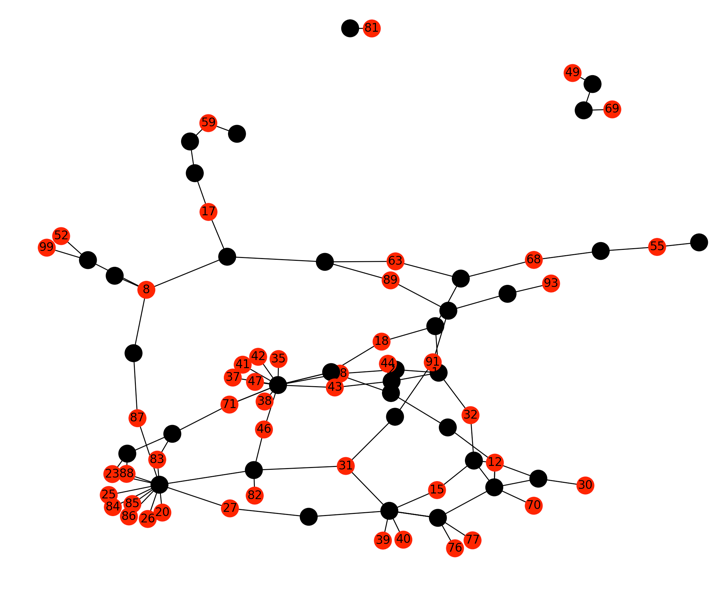

.. include:: global.rst

.. _usage:

Usage options
=============

mrbait_ reads all options and inputs using command-line arguments provided
after the program name. For a quick look at all options from the command line,
call the help menu by typing **mrbait -h** from the terminal.

Note that options requiring a floating point number (e.g. *-q*) allow inputs
from 0.0 to 1.0, and options requiring an integer (e.g. *-c*) allow inputs ranging
from 1 to infinity.

Main Parameters
---------------
General options
~~~~~~~~~~~~~~~

-r, --resume
   **Resume**: This flag is used to tell mrbait if you would like to resume work |br|
   following a particular step. Use this option in conjunction with the |br|
   **--db** flag to continue the pipeline if you would like to re-perform |br|
   filtering steps without needing to re-load and parse alignments

   Usage: |br|
   -r 1: Continue pipeline after Step 1 (loading alignments) |br|
   -r 2: Continue fter Step 2 (target discovery) |br|
   -r 3: Continue after Step 3 (target filtering) |br|
   -r 4: Continue after Step 4 (bait discovery) |br|
   For example, -r 4 will tell mrbait_ to re-do bait filtering and output

--db   **Database**: Use this with the --resume flag to specify a .sqlite |br|
   database file from which to start the pipeline.
-T, --threads   **Threads**: Number of threads to use with processes that run |br|
   in parallel. This will also be passed to vsearch_ and/or blast_ if those are |br|
   being called. [default=1]
-h, --help   **Help**: Exit and display the help menu

Input Options
~~~~~~~~~~~~~

-M, --maf
   **MAF input**: Use this to provide the path to the multiple alignment MAF file
-X, --xmfa
   **XMFA input**: As an alternative to the MAF file, you can provide the |br|
   .xmfa file output by the aligner Mauve.
-L, --loci
   **LOCI input**: Multiple alignments can also be provided using the |br|
   .loci file output by the RADseq assembly pipeline pyRAD.
-A, --assembly
   **FASTA input**: Genome assembly provided as FASTA
-V, --vcf
   **VCF input**: For use with --assembly: VCF file containing variant data
-G, --gff
   **GFF input**: For use with --assembly: GFF file containing feature data
--vcfALT
    **REF calling with VCF**: For use with --assembly and --vcf: This option  |br|
    tells mrbait to attempt to override N/gap characters in the reference sequence  |br|
		using values from the ALT column in the VCF file. [default=off; boolean]

Alignment filtering/ consensus options (use with -M, -X, -L)
~~~~~~~~~~~~~~~~~~~~~~~~~~~~~~~~~~~~~~~~~~~~~~~~~~~~~~~~~~~~

-c, --cov
  **Coverage**: Minimum number of individuals/sequences per alignment, |br|
  for MAF, XMFA, or LOCI inputs [default=1]
-l, --len
  **Minimum length**: Minimum alignment length to attempt bait design [default=80]
-q, --tresh  **Bad base threshold**: Threshold proportion of gaps or N (ambiguous or |br|
  poor quality) characters to over-ride the consensus base. For example, *-q 0.2* |br|
  would be interpreted as 20% of bases at a nucleotide position must be an “N” |br|
  or gap character in order for that character to be represented as the consensus |br|
  base. [default=0.1]
-Q, --max_ambig  **Max bad bases**: Maximum allowable proportion of gap/N characters |br|
  allowed in a consensus sequence before it will be discarded. *-Q 0.5* means a |br|
  consensus sequence can be 50% N’s or gap characters (“-“) before being dropped |br|
  from consideration. [default=0.5]
-k, --mask  **Mask threshold**: Threshold proportion of masked characters per nucleotide |br|
  column to mask the consensus base call. For use when case represents masking |br|
  information (where lowercase = masked), as when using the *-xsmall* option in |br|
  `RepeatMasker <http://www.repeatmasker.org/>`_ to flag low-complexity or repetitive sequences. |br|
  Case will be retained in the consensus on a per-base basis according to this threshold. |br|
  [default=0.1]
-K, --max_mask  **Max masked bases**: Maximum allowable proportion of masked characters |br|
  allowed in a consensus sequence before it will be discarded. *-K 0.5* means a |br|
  consensus sequence can be 50% masked (lowercase) before being |br|
  dropped from consideration.[default=0.5].

  If lowercase bases do not contain masking information, set to *-K 1.0*

General Bait Design Options
~~~~~~~~~~~~~~~~~~~~~~~~~~~

-b, --bait  **Bait length**: This is the length of desired baits, and will be used for |br|
  bait design as well as the sliding window width for target region |br|
  discovery [default=80]
-w, --win_shift  **Sliding window shift distance**: Shift distance for sliding window used |br|
  to discover target regions. Generally, there should not be a reason to |br|
  alter this. If target discovery (step 2) is taking a very long time, adjusting |br|
  this may make it faster although it could result in more targets failing |br|
  filtering [default=1]
-v, --var_max  **Maximum SNPs per bait**: Maximum allowable variants allowed in a bait |br|
  sequence. These can be expanded in the final output as each possible |br|
  non-ambiguous bait sequence for synthesis. Use this when there are not enough |br|
  conserved regions to capture enough loci for your design. [default=0]
-n, --numN  **Maximum Ns per bait**: Maximum allowable ambiguous (N) bases allowed |br|
  per bait. This could be increased when there are too many poor quality bases |br|
  in your alignment to design a sufficient number of probes, although keep in mind |br|
  this will affect the specificity of your resulting probes. [default=0]
-g, --numG  **Maximum gaps per bait**: Maximum allowable gap characters allowed per bait. |br|
  If dealing with alignments containing many indels, it might be desirable to |br|
  allow a small number per bait sequence. These can be expanded in the final |br|
  output using the -x,--expand option, which will expand gap characters as |br|
  A, G, T, C, and absent. [default=0]

Target Region Options
~~~~~~~~~~~~~~~~~~~~~

These are options primarily used to control which **target regions**, or regions
which could be enriched (e.g. conserved enough to design baits) will be used to
design the final set of bait sequences. Targets will be either *passed* or *failed*
depending on these criteria.

For example, you can constrain targets to fail if they are below 200 bases in length, or
above 5000 based in length by specifying *-F len=200,5000*. In this case, all targets
with total lengths outside of this range will fail, and be excluded from bait design.

-R, --mult_reg  **Multiple targets per locus**: By default, mrbait_ only chooses one target |br|
  region (e.g. conserved region for which baits could be designed) per locus/ |br|
  alignment. When multiple are discovered, they are ranked according to the |br|
  criterion selected with the *-S,--select_r* option. When *-R,--mult_reg* not |br|
  in use, only a single target region (and corresponding baits) is chosen per |br|
  alignment. [default=false]
-m, --min_mult  **Minimum length for multiple targets**: Specify this to set a minimum alignment |br|
  or locus length to allow multiple target regions to be selected. By default will |br|
  be set to the value of *-l,--len* (thus, when *-R,--mult_reg* is used, all loci |br|
  passing length filter will be allowed multiple targets).
-D, --dist_r
  **Distance between targets**: When *-R,--mult_reg* is in use, use this parameter |br|
  to specify the minimum distance between targets. When targets are in conflict |br|
  (e.g. they are less than *-D,--dist_r* bases apart), conflicts will be resolved |br|
  using the criterion set with *-S,--select_r*. [default=100]
--target_all
  **Use all loci as targets**: This option tells mrbait to use all *passing* loci |br|
  as target regions for bait design. Note that all target filtering options will |br|
  still be in effect. Use this option if your input loci are already curated, and |br|
  you simply want to design baits for them [default=False]
-d, --flank_dist
  **Flanking distance for target filtering**: Distance from boundaries of target |br|
  region to parse for counting SNPs, ambiguities, gaps, etc when filtering |br|
  target regions (see *-S,--select_r* and *-F,--filter_r*) [default=500]. |br|
  Note that this value will tell mrbait_ to search ‘*d*’ bases to the left AND |br|
  right of each target region. |br|
  Note that currently, the same *--flank_dist* value will be used for all filters.
-S, --select_r
  **Target selection criterion**: Method to resolve conflicts when targets are |br|
  too close together (e.g. when *-R* and *-D*), or when only choosing one target |br|
  per locus/alignment.

  Usage:
  *-S snp*: Select target with most SNPs within *d* bases |br|
  *-S bad*: Select target with least gaps/Ns within *d* bases |br|
  *-S cons*: Select target with least SNPs within *d* bases |br|
  *-S rand*: Randomly select a target [default] |br|

  Example: *-d 100 -S snp* to choose region with most SNPs within |br|
  100 flanking bases
-F, --filter_r
  **Target filtering criteria**: Method(s) used to filter all target regions. |br|
  Can be specified any number of times to use additional filtering criteria. |br|

  Usage: |br|
  *-F len=[x,y]*:  Length between *x* (min) and *y* (max) |br|
  *-F gap=[x]*:  Maximum of *x* indels in target region |br|
  *-F bad=[x]*:  Maximum of *x* N characters in target region |br|
  *-F snp=[x,y]*:  Between *x* (min) and *y* (max) SNPs w/in *d* |br|
  *-F mask=[x]*:  Maximum of *x* N characters in target region |br|
  *-F gc=[x,y]*:  G/C propotion between *x* (min) and *y* (max) |br|
  *-F rand=[x]*:  Randomly retain *x* targets |br|
  *-F pw=[i,q]*:  Pairwise alignment, removing when *i* percent identity over at least *q* proportion of the sequences |br|
  *-F blast_i=[i,q]*:  Only retain BLAST hits with *i* percent identity over at least *q* query coverage |br|
  *-F blast_i=[i,q]*:  Exclude BLAST hits with *i* percent identity over at least *q* query coverage |br|
  *-F gff=[type]*:  Only retain targets within *d* bases of a GFF-annotated feature of type type. Only for use when *-A* and *-G* inputs provided. Use *-F gff=all* to target any type of annotated feature. |br|
  *-F gff_a=[alias]*:  Only retain targets within *d* bases of a GFF-annotated feature of tagged with the Alias attribute matching alias. Only for use when *-A* and *-G* inputs provided. |br|

  Examples: |br|
  *-F snp=1,10 -d 100* to sample when 1-10 SNPs within 100 bases |br|
  *-F gc=0.2,0.8 -F rand=100* to keep 100 random targets w/ 20-80% GC |br|
  *-F mask=0.1* to remove targets with >10% masked bases |br|
  *-d 1000 -F gff=exon* to keep targets within 100 bases of an exon |br|

Bait Selection Options
~~~~~~~~~~~~~~~~~~~~~~

These options are used to specify how baits will be designed in passing target
regions (*-s, --select_b*) and how designed baits will be curated to create
the final set of sequences for synthesis (*-f, --filter_b*).

The default behavior is to tile baits across all *passing* target regions, with
an overlap of 50%. This corresponds to ~2X coverage across the target region. Only
passing baits will be included in the final output FASTA file.

-s, --select_b  **Bait selection scheme**: Use this to specify the desired method |br|
  to design baits from passing target regions.

  Usage: |br|
  *-s tile=[x]*: Tile baits over whole region, with *x* overlap |br|
  *-s center=[n,x]*: *n* centered baits with *x* overlap |br|
  *-s calc=[n,x]*: Design *n* baits per target with *x* maximum overlap |br|
  *-s flank=[n,x]*: *n* terminal baits (each end) with *x* overlap
  Default behavior is to tile baits across all targets with 50% overlap

-f, --filter_b
  **Bait filtering criteria**: Method(s) used to filter baits. |br|
  Can be specified any number of times to use additional filtering criteria.

  Usage: |br|
  *-f mask=[x]*:  Maximum of *x* N characters in target region
  *-f gc=[x,y]*:  G/C propotion between *x* (min) and *y* (max)
  *-f rand=[x]*:  Randomly retain *x* targets
  *-f pw=[i,q]*:  Pairwise alignment, removing when *i* percent identity over at least *q* proportion of the sequences |br|
  *-f rc=[i,q]*:  Pairwise align reverse complements, where i and q are as in -f pw |br|
  *-f blast_i=[i,q]*:  Only retain BLAST hits with *i* percent identity over at least *q* query coverage |br|
  *-f blast_i=[i,q]*:  Exclude BLAST hits with *i* percent identity over at least *q* query coverage

Output Options
~~~~~~~~~~~~~~

Use these options to control the format of your output file, or to specify non-default
output files.

-x, --expand  **Bait format**: Boolean. Use this flag if you want any ambiguities |br|
  in bait sequences to be expanded (e.g. N = A,G,C,T). IUPAC codes will be fully |br|
  expanded, and gap characters will be expanded as all nucleotides and as |br|
  absent. Bait sequences will be output as FASTA to $out_baits.fasta
-t, --print_tr  **Print target regions**: Boolean. Use this flag if you would |br|
  like target regions to be printed to a FASTA file. FASTA headers will reflect |br|
  locus number, target number within locus, and pass=T or pass=F indicating if the |br|
  target passed or failed filtering specified using the *-F,--filter_r* options, as|br|
  well as any targets which were excluded due to -S,--select_r criteria. Output file |br|
  will be named as $out_targets.fasta.
--print_loc  **Print locus cataog**: Boolean. Prints consensus loci, formatted as in *--print_tr*
--strand  **Output strand**: Use this if you want to print baits as-designed, or as |br|
  reverse complement. Possible values: “+” [default], “-” (reverse-complement), |br|
  or “both”.
-o, --out  **Output prefix**: Desired prefix for output files. Default is “out”.

Filtering using vsearch_
------------------------
Using the --filter_r or --filter_b ‘pw’ (for pairwise-align) options call an external open-source
package vsearch_. Internally, this is accomplished using the “*allpairs_global*” function in
vsearch_, which performs all-vs-all global alignments of target or bait sequences.
mrbait_ then parses the output of vsearch_ to find pairs of sequences with greater
than *i* percent identity over at least *q* percent of the query sequence.
Sequences are first sorted by length, meaning the *q* proportion should be measured
by the shorter of the two sequences in each pairwise alignment (although when called
with the *--filter_b* command, all pairs are of equal length). Because all sequences
will be compared in a pairwise fashion, keep in mind that this step could take
considerable time, although VSEARCH is exceptionally efficient and does take advantage
of multiple cores for parallel computation (passed using the --threads argument).

If you did NOT install vsearch_ using the conda_ installation instructions for mrbait_,
you may need to point mrbait_ to the vsearch_ executable. You can specify this path, as
well asspecify how mrbait parses the results of vsearch using the following parameters:

vsearch_ Options
~~~~~~~~~~~~~~~~
--vsearch  **VSEARCH binary**: Path to vsearch_ binary. If installed via conda_ |br|
  install, the bioconda recipe will be used, and placed into the bin/ folder for |br|
  your conda_ installation. mrbait_, by default, assumes that the vsearch_ executable |br|
  is locatable in your $PATH as “vsearch”. If this is not the case, provide an |br|
  alternate path using this flag.
--vthreads  **VSEARCH threads**: Number of threads to use for vsearch_. By default, |br|
  this is assumed to be the same value as the *--threads* argument passed to mrbait_
--noGraph  **No conflict graph**: By default, mrbait will try to recover as many |br|
  sequences as possible from the pairwise alignment results by using a graph |br|
  structure (see below) to remove only enough sequences to resolve all conflicts
--noWeightGraph  **Unweighted conflict resolution**: By default, mrbait weights all |br|
  nodes by the number of SNPs that the corresponding target or bait captures. |br|
  Use this option to turn this off, and instead use the built-in maximal_independent_set |br|
  function from the networkx_ package.
--weightByMin  **Weight by minimum ambiguity**: Instead of trying to keep sequences |br|
  with the most flanking SNPs, this option tries to keep sequences with the fewest |br|
  gap or N characters in flanking sequences.
--weightMax  **Maximum size to attempt weighting**: Maximum graph size to attempt |br|
  weighted algorithm for finding maximal independent set. Graphs larger than this |br|
  size will use the maximal_independent_set function from the networkx_ package, |br|
  which is slightly faster.

Graph-based conflict resolution
~~~~~~~~~~~~~~~~~~~~~~~~~~~~~~~

After vsearch_ is complete, mrbait will parse the output and represent all ‘conflicting’
sequences (e.g. those which aligned with i or greater identity and q or greater query
coverage) as a graph structure, with nodes as the primary key (ID) for the SQLite
entry corresponding to each sequence, and edges unweighted and representing ‘conflicts’
from the pairwise alignment. By default, mrbait uses this graph structure to attempt to
rescue as many sequences as possible which failed the pairwise alignment filter by using
an algorithm to find the most sequences which can be “kept” while removing all edges (conflicts)
from the graph (e.g. see Figure 2 below).

This is accomplished by searching through all edges, removing the node (target or bait)
which captures the least flanking SNPs in the original alignments, or if this value is
equal by removing the node with the most neighbors (=conflicting sequences). If both
quantities are equal, one is chosen at random. Options are provided to turn off this
behavior altogether, or to weight nodes according to how many gap/N characters flank
them, or to alternatively use the maximal_independent_set function from the networkx_
package. Unfortunately, finding the maximal independent set of a graph (i.e. the
maximum number of nodes to retain while removing all edges) is an extremely hard problem,
and cannot be done in a particularly efficient manner. Thus, with very large sets of target
sequences, this can take quite a while if there is a lot of highly matching alignments
among them.

Figure 2: Example maximal independent set (plotted using the matplotlib for Python!)
where nodes in red are those which have been kept by the algorithm. Black nodes represent
sequences which would be deleted (e.g. baits which fail the ‘pw’ filter). Although
red nodes may be indirectly connected by black ‘failed’ nodes (i.e. by multiple edges),
no direct edges remain in the graph after removing failed nodes.

Filtering using blast_
----------------------
The NCBI-BLAST+ package (https://blast.ncbi.nlm.nih.gov/Blast.cgi) can also be called
using a similar scheme of setting a threshold of *i* sequence identity of hits, and *q*
query coverage. Currently, mrbait supports blastn filtering using these cutoff values
to either exclude (*blast_x*) or include (*blast_i*) sequences based on presence of hits.

Usage of the ‘*blast_x*’ option for either target (*--filter_r*) or bait (*--filter_b*)
filtering would most generally be used to prevent non-target matches to potential
contaminant DNA, given a representative genome for the putative non-target organism
(for example a common bacterial contaminant). If such a reference genome is lacking,
you can also increase specificity of chosen targets or baits using the ‘*blast_i*’
option, which only retains queries with hits to a specified genome.

When using either ‘*blast_x*’ or ‘*blast_i*’ options for filtering, a database file must
be specified either as a pre-built BLAST-formatted database using the *--blastdb* flag,
or alternatively as a FASTA file using *--fastadb*. In the latter case, mrbait will
call the NCBI MakeBlastDB executable. When using the conda_ install, this is included
with all other BLAST+ binaries (including the blastn executable also required by
mrbait for BLAST filtering). If not using the conda installation instructions,
these are both assumed to be accessible in your $PATH as ‘*blastn*’ and ‘*makeblastdb*’.

Please note that with particularly large sets of query sequences, this process may
take a while, although it does take advantage of multithreading if passed via the
*--threads* argument.

BLAST options:

--blastn  **BLASTN binary**: Path to blastn binary. If installed via conda_ |br|
  install, the bioconda recipe will be used, and placed into the bin/ folder |br|
  for your conda_ installation. mrbait_, by default, assumes that the |br|
  blastn executable is locatable in your $PATH as “blastn”. If this is not |br|
  the case, provide an alternate path using this flag.
--makedb  **MakeBlastDB binary**: Path to makeblastdb binary. If installed via |br|
  conda_ install, the bioconda recipe will be used, and placed into the bin/ |br|
  folder for your conda installation. Mrbait, by default, assumes that the |br|
  makeblastdb executable is locatable in your $PATH as “makeblastdb”. If this |br|
  is not the case, provide an alternate path using this flag.
--blastdb  **Path to BLAST database**: Full path to formatted database to search against
--fastadb  **Path to FASTA database**: If database is provided as a FASTA file, |br|
  and requires building using the makeblastdb command, provide that path here.
--e_value  **E-value threshold**: Minimum e-value cutoff to report BLAST hits |br|
  [default=0.000001]
--gapopen  **Gap opening penalty**: Penalty for opening gaps when performing |br|
  alignment [default=5]
--gapextend  **Gap extension penalty**: Penalty for extending gaps when |br|
  performing alignment [default=2]
--word_size  **Word size**: Word size [default=11]
--nodust  **Turn off dusting**: Use this flag to turn off the low-complexity |br|
  filter using by blastn. Depending on what your goals are for BLAST filtering, |br|
  this may be necessary. Boolean.
--megablast  **Use megablast**: Use this flag to switch to the *megablast* |br|
  algorithm. It is recommended you use this if you are trying to exclusively find |br|
  nearly identical alignments to a very closely related genome.
